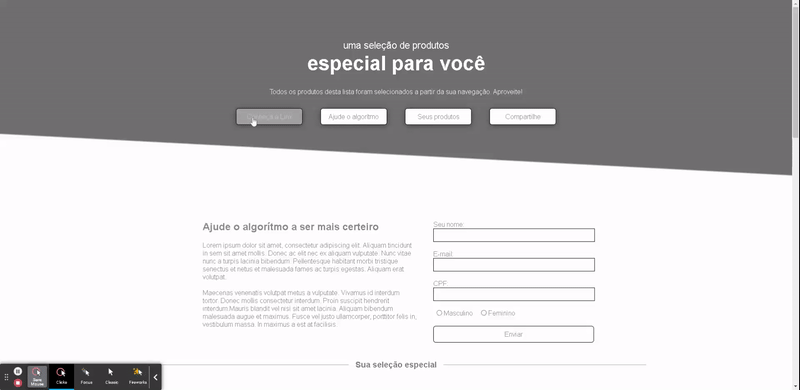

<h1 align="center">Linx Challenge</h1>

<h1 align="center"></h1>

## ✨ Technologies

This project has been setted with the following technologies:

- [HTML](https://www.w3schools.com/TAGS/default.ASP)
- [CSS](https://www.w3schools.com/cssref/default.asp)
- [JavaScript](https://developer.mozilla.org/pt-BR/docs/Web/JavaScript)
- [Live Server](https://marketplace.visualstudio.com/items?itemName=ritwickdey.LiveServer)

## 💻 Project

HTML, CSS and JavaScript vanilla, single page e-commerce application.
You can preview at [VERCEL](https://linx-challenge-nu.vercel.app/).

## 🚀 How to run

### Option 1 
- Clone this repository.
- Drag `index.html` file.
- Drop it at your browser.

### Option 2
- Clone this repository.
- Open project folder at Visual Studio Code
- install 'Live Server' extension.
- Right click on `index.html`, then `Open with live server`.
- It will open on your default browser.